```mermaid
graph TD
    A["He Thong Quan Ly Ca Phe Dam Da"] --> B["Quan Ly San Pham"]
    A --> C["Quan Ly Ban Hang"]
    A --> D["Quan Ly Nguoi Dung"]
    A --> E["Quan Ly Don Hang"]
    A --> F["Thong Ke va Bao Cao"]

    B --> B1["Them San Pham"]
    B --> B2["Chinh Sua San Pham"]
    B --> B3["Xoa San Pham"]
    B --> B4["Xem Danh Sach San Pham"]
    B --> B5["Tim Kiem va Loc San Pham"]
    B --> B6["Quan Ly Ton Kho"]

    C --> C1["Them Vao Gio Hang"]
    C --> C2["Xem Gio Hang"]
    C --> C3["Sua So Luong San Pham"]
    C --> C4["Xoa San Pham Khoi Gio"]
    C --> C5["Thanh Toan Don Hang"]
    C --> C6["Chon Phuong Thuc Thanh Toan"]
    C --> C7["Quan Ly Dia Chi Giao Hang"]

    D --> D1["Dang Ky Tai Khoan"]
    D --> D2["Dang Nhap"]
    D --> D3["Xem Thong Tin Ca Nhan"]
    D --> D4["Cap Nhat Thong Tin"]
    D --> D5["Doi Mat Khau"]
    D --> D6["Quan Ly So Dia Chi"]

    E --> E1["Tao Don Hang"]
    E --> E2["Xem Danh Sach Don Hang"]
    E --> E3["Xem Chi Tiet Don Hang"]
    E --> E4["Cap Nhat Trang Thai Don Hang"]
    E --> E5["Huy Don Hang"]
    E --> E6["Theo Doi Trang Thai"]

    F --> F1["Thong Ke Doanh Thu"]
    F --> F2["Thong Ke San Pham"]
    F --> F3["Thong Ke Nguoi Dung"]
    F --> F4["Thong Ke Don Hang"]
    F --> F5["Xuat Bao Cao"]

    style A fill:#FF6B6B,stroke:#C92A2A,stroke-width:3px,color:#fff
    style B fill:#4ECDC4,stroke:#1A7A7A,stroke-width:2px,color:#fff
    style C fill:#45B7D1,stroke:#0C5F7F,stroke-width:2px,color:#fff
    style D fill:#96CEB4,stroke:#4A7C59,stroke-width:2px,color:#fff
    style E fill:#FFEAA7,stroke:#DDA15E,stroke-width:2px,color:#333
    style F fill:#DDA0DD,stroke:#9932CC,stroke-width:2px,color:#fff
```

## Cách sử dụng:

### 1. **Dùng Mermaid Live Editor** (Nhanh nhất)
Truy cập: https://mermaid.live
- Copy đoạn code trên vào
- Sơ đồ sẽ tự động vẽ
- Có thể export PNG/SVG

### 2. **Dùng Markdown (GitHub, GitLab)**
Tạo file `.md` hoặc `.txt`, paste code trên sẽ tự động render

### 3. **Dùng Draw.io**
- Truy cập: https://draw.io
- File → New Diagram → Paste code vào "Paste XML"
- Hoặc manually vẽ lại theo cấu trúc

### 4. **Dùng Visual Studio Code**
- Cài extension: "Markdown Preview Mermaid Support"
- Tạo file `.md` chứa code
- Preview xem sơ đồ

---

## Giải thích Sơ Đồ:

```
Mức 0 (Tổng hệ thống):
├── Hệ Thống Quản Lý Cà Phê Đậm Đà

Mức 1 (Các module chính):
├── Quản Lý Sản Phẩm
├── Quản Lý Bán Hàng
├── Quản Lý Người Dùng
├── Quản Lý Đơn Hàng
└── Thống Kê & Báo Cáo

Mức 2 (Chức năng chi tiết):
├── Quản Lý Sản Phẩm
│   ├── Thêm Sản Phẩm
│   ├── Chỉnh Sửa Sản Phẩm
│   ├── Xóa Sản Phẩm
│   ├── Xem Danh Sách Sản Phẩm
│   ├── Tìm Kiếm & Lọc Sản Phẩm
│   └── Quản Lý Tồn Kho
│
├── Quản Lý Bán Hàng
│   ├── Thêm Vào Giỏ Hàng
│   ├── Xem Giỏ Hàng
│   ├── Sửa Số Lượng Sản Phẩm
│   ├── Xóa Sản Phẩm Khỏi Giỏ
│   ├── Thanh Toán Đơn Hàng
│   ├── Chọn Phương Thức Thanh Toán
│   └── Quản Lý Địa Chỉ Giao Hàng
│
├── Quản Lý Người Dùng
│   ├── Đăng Ký Tài Khoản
│   ├── Đăng Nhập
│   ├── Xem Thông Tin Cá Nhân
│   ├── Cập Nhật Thông Tin
│   ├── Đổi Mật Khẩu
│   └── Quản Lý Sổ Địa Chỉ
│
├── Quản Lý Đơn Hàng
│   ├── Tạo Đơn Hàng
│   ├── Xem Danh Sách Đơn Hàng
│   ├── Xem Chi Tiết Đơn Hàng
│   ├── Cập Nhật Trạng Thái Đơn Hàng
│   ├── Huỷ Đơn Hàng
│   └── Theo Dõi Trạng Thái
│
└── Thống Kê & Báo Cáo
    ├── Thống Kê Doanh Thu
    ├── Thống Kê Sản Phẩm
    ├── Thống Kê Người Dùng
    ├── Thống Kê Đơn Hàng
    └── Xuất Báo Cáo
```

---

## Màu sắc trong sơ đồ:

- 🔴 **Đỏ** - Hệ thống chính (Mức 0)
- 🟢 **Xanh lá** - Quản Lý Sản Phẩm
- 🔵 **Xanh dương** - Quản Lý Bán Hàng
- 💚 **Xanh mint** - Quản Lý Người Dùng
- 🟡 **Vàng** - Quản Lý Đơn Hàng
- 💜 **Tím** - Thống Kê & Báo Cáo

---

**Ngày tạo:** 14/11/2025  
**Phiên bản:** 1.0  
**Loại:** Business Function Diagram (BFD) - Mức 2
